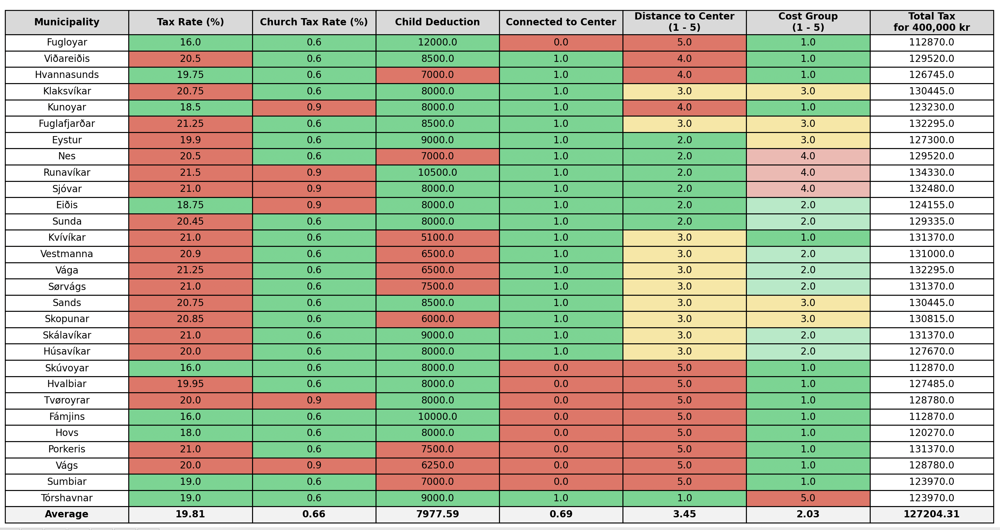

# Faroe Islands Cost Analysis

This project offers a visual analysis of municipal tax rates and associated costs across the Faroe Islands. Utilizing Python and Matplotlib, it generates detailed tables that compare municipalities based on various financial and logistical metrics.

## 📊 Features

Tax Computation: Calculates total tax liabilities for a standardized income, incorporating municipal, church, and federal taxes.

Data Visualization: Produces color-coded tables highlighting deviations from average values, facilitating quick insights.

Customizable Labels: Allows for tailored column headers to enhance readability and context.

Average Metrics: Appends an average row to provide a benchmark across all municipalities.

## 🗂️ Project Structure

```
faroe_islands_cost_analysis/
├── data/
│   └── 2025.csv
├── src/
│   └── run.py
├── requirements.txt
└── README.md
```

`data/`: Contains CSV files with annual municipal data.

`src/run.py`: Main script for data processing and visualization.

`requirements.txt`: Lists necessary Python packages.

`README.md`: Project overview and usage instructions.
GitHub

## ⚙️ Installation

```
git clone https://github.com/bardurt/faroe_islands_cost_analysis.git
cd faroe_islands_cost_analysis
```

### Install Dependencies:
```
pip install -r requirements.txt
```

## Usage
To generate the visualization for a specific year (e.g., 2025):

```
python src/run.py 2025
```
If no year is specified, the script defaults to the current year.

### 📈 Sample Output
After execution, a Matplotlib window will display a table similar to the one below:


## 📄 Data Format
Each CSV file in the `data/` directory should have the following columns:

`municipal`: Name of the municipality.

`tax`: Municipal tax rate (percentage).

`churchtax`: Church tax rate (percentage).

`child_deduction`: Amount deducted per child.

`connected_to_center`: Binary indicator (1 if connected to center, 0 otherwise).

`distance_to_center`: Distance to the central area (scale of 1 to 5).

`cost_group`: Cost grouping (scale of 1 to 5).

## 📜 License
This project is licensed under the MIT License.


## More
For questions or suggestions, please open an issue or contact the repository maintainer.